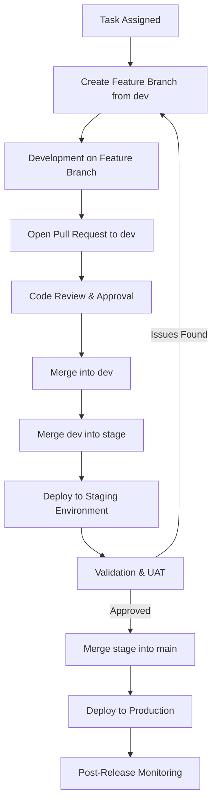

# MenuClone Release Cycle

This document outlines the release cycle for MenuClone. It defines the steps code must follow from assignment to production deployment, ensuring quality, traceability, and team alignment.

---

## Branching Strategy

- **main** → Production-ready branch. Only tested, approved code goes here.
- **stage** → Pre-production branch. Used for validation and UAT by non-developers.
- **dev** → Active development branch. Integration point for all features and fixes.
- **feature/\*** → Temporary branches created for each task or bug fix.

---

## Release Workflow

### **1. Task Assignment**

- A new feature branch is created from `dev`.
- Naming convention:

  ```
  <ticket_type>/<business_group>-<ticket_number>_purpose
  ```

  #### Explanation of the convention:

  - **`<ticket_type>`** → Describes what kind of work the branch is for.
    - Examples: `feature/`, `fix/`, `hotfix/`, `chore/`.
  - **`<business_group>`** → Refers to the product area or team domain (e.g., `claims`, `billing`, `jobs`).
  - **`<ticket_number>`** → Links the branch to a specific ticket in the issue tracker (e.g., Jira, Trello, GitHub Issues).
  - **`_purpose`** → Short description of the change (e.g., `add-policy-comparison`, `fix-login-redirect`).

  #### Example:

  ```
  feature/claims-45_add-policy-comparison
  ```

  - `feature/` → This branch adds a new feature.
  - `claims` → Belongs to the claims module.
  - `45` → Connected to ticket #45.
  - `_add-policy-comparison` → Purpose is to add a policy comparison feature.

  > **Note for MenuClone**: If business groups are not needed yet, the naming can be simplified to:
  >
  > ```
  > <ticket_type>/<ticket_number>_<purpose>
  > ```
  >
  > Example: `feature/12_add-job-insights`

---

### **2. Development**

- Developer implements changes on the feature branch.
- Code is regularly committed with meaningful commit messages (see **Commit Message Guidelines**).
- When the task is complete, a Pull Request (PR) is opened against `dev`.

---

### **3. Code Review**

- Peer review is required before merging into `dev`.
- Reviewer checks for:
  - Code quality and readability
  - Adherence to standards
  - Potential bugs or performance issues
- Once approved, feature branch is merged into `dev` and deleted.

---

### **4. Staging**

- When a milestone or set of features is ready, `dev` is merged into `stage`.
- Code is deployed to the staging environment.
- Validation is performed by non-developer stakeholders (QA, product, etc.).
- Any bugs identified are fixed via new feature/fix branches → merged into `dev` → re-deployed to `stage`.

---

### **5. Production Release**

- Once staging is approved, `stage` is merged into `main`.
- Deployment to production is triggered.
- Post-deployment smoke tests are run to ensure stability.

---

### **6. Post-Release**

- Monitor logs and errors after release.
- Hotfixes (if needed) follow the same process:
  - Create `fix/` branch → merge into `dev` → promote through `stage` → `main`.

---

## Commit Message Guidelines

To maintain clarity in version control history, MenuClone follows a lightweight convention:

```
<type>(<scope>): <short summary>
```

- **Types**:

  - `feat` → New feature
  - `fix` → Bug fix
  - `docs` → Documentation changes
  - `style` → Code style (formatting, missing semi-colons, etc.)
  - `refactor` → Code changes that don’t fix bugs or add features
  - `test` → Adding or modifying tests
  - `chore` → Maintenance tasks (e.g., build, dependencies)

- **Scope**: Optional, module or area affected (e.g., `auth`, `jobs`, `dashboard`).
- **Summary**: A concise description in imperative tone.

#### Examples:

```
feat(jobs): add job insights widget
fix(auth): resolve login redirect loop
docs: update release cycle documentation
```

This ensures branch names, commits, and PR titles align for better traceability.

---

## Future Enhancements

- **CI/CD Integration**: Automated builds, linting, and testing on every PR.
- **Release Tags**: Tagging each production release (e.g., `v1.2.0`).
- **Automated Deployments**: Deploy from GitHub Actions/GitLab CI to staging and production.

---

## Release Cycle Diagram


